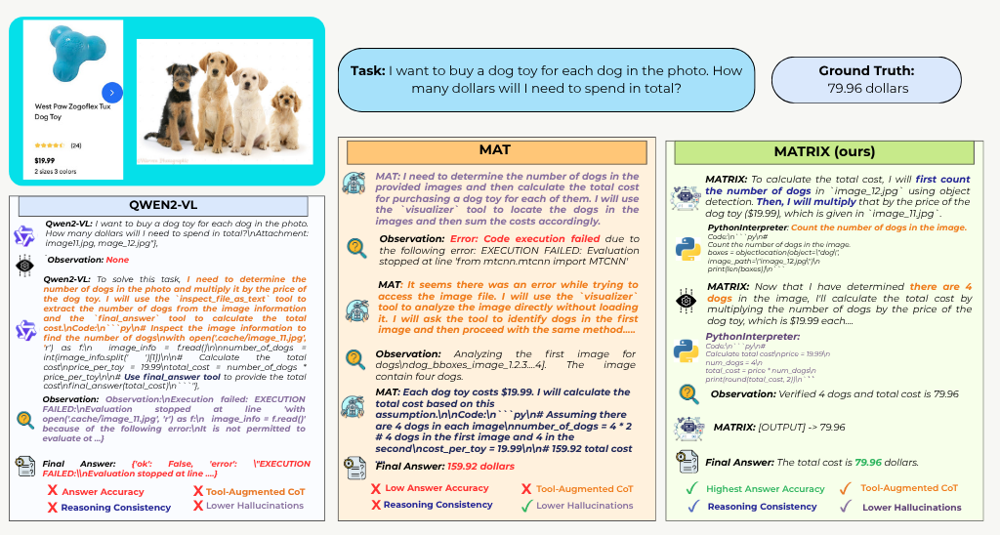
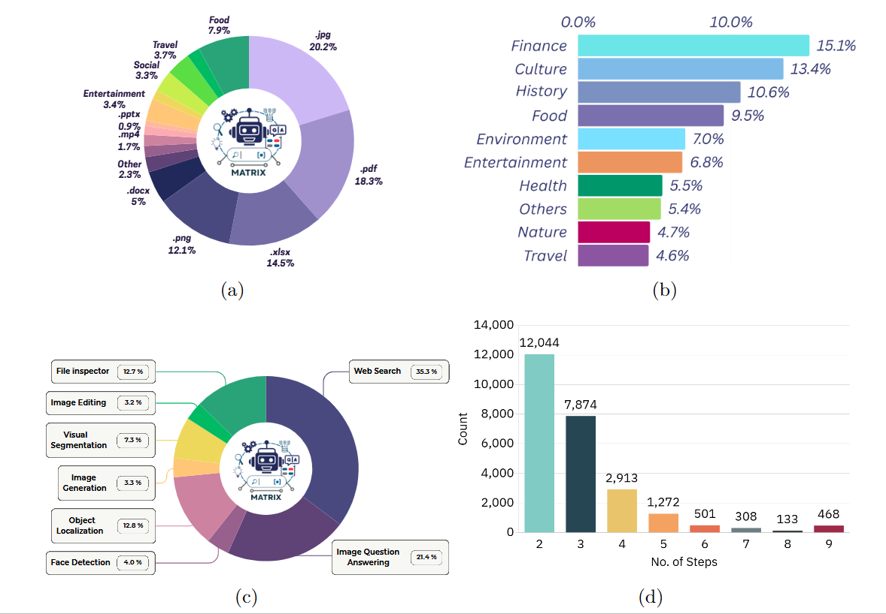

# MATRIX: Multimodal Agent Tuning for Robust Tool-Use Reasoning  
<p align="center">
  <a href="https://arxiv.org/pdf/2510.08567"><b>📄 Paper</b></a> •
  <a href="https://github.com/mbzuai-oryx/MATRIX"><b>💻 Code</b></a> •
  <a href="https://huggingface.co/datasets/mbzuai/M-TRACE"><b>🤗 Data</b></a> •
  <a href="https://tajamulashraf.com/matrix"><b>🌍 Project Page</b></a>
</p>

---


---

## 🚀 Overview

**MATRIX** is a **vision-centric multimodal agent** designed for **reliable step-wise reasoning** and **grounded tool use**.  
It introduces a **two-stage tuning framework**:

1. **Trajectory-driven Supervised Fine-Tuning (SFT)** using the large-scale **M-TRACE dataset**.  
2. **Step-wise Preference Optimization** via **Direct Preference Optimization (DPO)** using the **Pref-X dataset**.  

This staged design enables robust decision-making, recovery from partial rollouts, and fine-grained reasoning in open-world multimodal environments.

---

## 📊 Performance Highlights

| Benchmark | Metric | Open Baseline (Qwen2-VL-7B) | **MATRIX (Ours)** | Improvement |
|------------|---------|------------------------------|-------------------|--------------|
| **Agent-X** | Step-by-Step | 0.51 | **0.59** | +8% |
|  | Deep Reasoning | 0.39 | **0.44** | +5% |
|  | Tool Accuracy | 0.54 | **0.91** | +37% |
|  | Faithfulness Accuracy | 0.62 | **0.71** | +9% |
|  | Factual Precision | 0.34 | **0.88** | +54% |
|  | Grounding Accuracy | 0.55 | **0.76** | +21% |
|  | Overall Outcome | 0.57 | **0.77** | +20% |
| **GTA** | Answer Accuracy | 42.31% | **65.38% ± 4%** | +23.07% |
| **GAIA** | Level 1 / Level 2 / Level 3 / Avg. | 16.98 / 8.14 / 0.00 / 9.70 | **29.15 / 19.28 / 6.84 / 21.47 ± 3%** | +11–12% |

---

📈 **Summary:**  
- On **Agent-X**, MATRIX achieves the highest **tool and reasoning accuracy** among open-source agents, improving tool accuracy by **+37%** and overall performance by **+20%**.  
- On **GTA**, MATRIX outperforms all open and closed-source controllers by **+23%** in answer accuracy.  
- On **GAIA**, MATRIX shows consistent gains across all reasoning levels, with up to **+12%** improvement on average accuracy.


<p align="center">
  
</p>
<p align="center">
  
</p>

---

## 📦 Datasets

### 🔹 M-TRACE
- **28.5K multimodal tasks**, **177K verified trajectories**.  
- Double-verified for **semantic accuracy** and **execution validity**.  
- Forms the foundation for grounded tool reasoning.

### 🔹 Pref-X
- **11K step-wise preference pairs** synthesized via exploration and verification.  
- Enables **fine-grained, reinforcement-free optimization** with DPO.  
- Improves accuracy, consistency, and robustness across reasoning steps.

<p align="center">
  
</p>

# 🛠️ Setup

## Install environment
```bash
conda create -n tongagent python=3.10
conda activate tongagent

pip install -r requirements.txt
```

If you want to generate data by yourself, install the following environment.
```bash
pip install -r requirements_generation.txt
```
## Dowanload dataset
You can use `git lfs` or `huggingface-cli` to download the dataset we used in paper from [HF dataset](https://huggingface.co/datasets/PengxiangLi/MAT). **Images related to training is zipped in a file called files.zip**.


## Image source

The image captions and caption embeddings can be downloaded via the following link:
[Google Drive](https://drive.google.com/drive/folders/1Ek6qfmhcaTd7zTEQcBvELh6i7unVhTrk?usp=sharing).

Please follow [ShareGPT4V](https://sharegpt4v.github.io/) to organize the image source as follows:
```none

├── ...
├── image_source
│   ├── llava
│   │   ├── llava_pretrain
│   │   │   ├── images
│   ├── coco
│   │   ├── train2017
│   ├── sam
│   │   ├── images
│   ├── web-celebrity
│   │   ├── images
│   ├── web-landmark
│   │   ├── images
│   ├── wikiart
│   ├── share_textvqa
│   │   ├── images
│   ├── chatqa
│   │   ├── train
│   │   │   ├── png

```

## Download model parameters for vision tools
You only need to download SAM 2 manually. For other models, `transformers` will do downloading for you.

Put the folder `model_checkpoints` in your repo's root so that you have something like
```
main.py
model_checkpoints/sam2_checkpoints
model_checkpoints/sam2_configs
```
You can download the model checkpoints and configs by scripts from from the official repo.
* [sam2_checkpoints](https://github.com/facebookresearch/sam2/blob/main/checkpoints/download_ckpts.sh)
* [sam2_configs](https://github.com/facebookresearch/sam2?tab=readme-ov-file#sam-21-checkpoints)

### Setup Google Customized Search
This project using Google Customized Search to search the web. You need to set the `cx` and `key` in `configs/agent_config.yaml`. You will find the `cx` and `key` in the `search_engine` section.
```yaml
search_engine:
  -
    cx: # enter your cx here
    key: # enter your key here
```
To obtain this key, check the official API documentation[here](https://console.cloud.google.com/apis/api/customsearch.googleapis.com). It has a rate-limit 100 query per day for free user 10k query per day for paid user.


# Execute with closed-source api
## Setup
First, you need to set the api key and endpoint in `configs/agent_config.yaml`. The config file looks like this:
```yaml
tonggpt:
  model_name:  gpt-4o-2024-08-06
  region: eastus
  api_key: # enter your api key here
  open_ai_client_type: openai # or azure
  endpoint: # only for azure, you need to specify the endpoint you are using

agent_controller:
  engine_type: tonggpt # use minicpm, qwen if you want to use other models
```
We use GPT on Azure and provide a simple alternative for you to use original OpenAI client.

## Download benchmark dataset
You can download the GTA dataset from [GTA Link](https://github.com/open-compass/GTA/releases/download/v0.1.0/gta_dataset.zip), and revise your dataset path `data/gta_dataset/dataset.json` in `examples/gta/main.py` if you put it in some other path.

You can download the GAIA dataset from [GAIA Link](https://huggingface.co/datasets/gaia-benchmark/GAIA). Or running evaluation script will automatically download the dataset from HF.

## Run

Run in command line manner with arbitrary prompt.
```bash
python main.py --prompt 'Can you edit the image to turn him into cyborg? Image path: tests/data/draw.jpg.'
```

See results runing on GAIA set
```bash
python examples/gaia/main.py
```

See results runing on GTA set
```bash
python examples/gta/main.py
```

# Experiments
## Qwen-VL
Refer to official repo [Qwen-VL](https://github.com/QwenLM/Qwen2-VL) for environment setup.


After setup the environment, you can run the script convert dataset from MiniCPM-V to Qwen-VL format:
```bash
cd experiments/Qwen-VL

python scripts/convert_dataset_v2.py
```
Then you can run the script to train the model:
```bash
bash slurm_jobs/train_gaia.sh
bash slurm_jobs/train_gta.sh
```

## Evaluation
To evaluate the model, first modify the `configs/agent_config.yaml` to set the model path. Then run the script:
```bash
export RUN_MODE=eval

# for GAIA dataset
python examples/gaia/main.py --engine minicpm --lora-path experiments/CPM-FT/output/cpm_v2_6_7904295_2024_12_10_23_05/ --data-name 2023_level1 --split validation

python examples/gaia/main.py --engine minicpm --lora-path experiments/CPM-FT/output/cpm_v2_6_7904295_2024_12_10_23_05/ --data-name 2023_level2 --split validation

python examples/gaia/main.py --engine minicpm --lora-path experiments/CPM-FT/output/cpm_v2_6_7904295_2024_12_10_23_05/ --data-name 2023_level3 --split validation
# for GTA dataset
python examples/gta/main.py --engine minicpm --lora-path experiments/CPM-FT/output/cpm_v2_6_7904295_2024_12_10_23_05/
```
`cpm_v2_6_7904295_2024_12_10_23_05` is the model path. The training script automatically saves the model to that path. We use SLURM in our cluster such that the path consists of the job id and the time of the job. You should check the training script for the exact path.

Both benchmarks will output the results in `.cache` folder. You should use `eval.py` to get the metric we reported in the paper.

```bash
python examples/gaia/eval.py --data-path .cache/qa_cache/validation/minicpm/experiments/CPM-FT/output/cpm_v2_6_7904295_2024_12_10_23_05/2023_level1.db

python examples/gta/eval.py --folder .cache/gta/cpm_v2_6_7904295_2024_12_10_23_05/
```

## Data Generation
Run in command line manner. 
```bash
bash data_generation.sh
```

## 🌟 Star History
[](https://star-history.com/#mat-agent/MAT-Agent&Date)


# 🙏 Acknowledgements

We gratefully acknowledge the open-source community for their brilliant contributions!  
**MATRIX** builds upon and is inspired by several outstanding frameworks and research efforts.

### 🔧 Frameworks and Base Code
- [HuggingFace Agents](https://huggingface.co/docs/transformers/v4.47.1/en/main_classes/agent#transformers.ReactCodeAgent) — foundation for the agent framework.
- [MiniCPM-V](https://github.com/OpenBMB/MiniCPM-V) — model training and inference utilities.
- [Qwen2-VL](https://github.com/QwenLM/Qwen2-VL) — vision-language model backbone.

### 💡 Related Works and Inspiration
- [GAIA](https://github.com/aymeric-roucher/GAIA) — multimodal reasoning and evaluation benchmarks.
- [Sibyl-System](https://github.com/Ag2S1/Sibyl-System) — hierarchical agent control framework.
- [MAT (Multi-modal Agent Tuning)](https://github.com/mat-agent/MAT-Agent) — multimodal tool-use agent and dataset design inspiration.

We extend our sincere thanks to all open-source contributors whose work helped make **MATRIX** possible.

---

# 📝 Citation

If you find our work helpful, please consider citing our paper 📝 and giving us a ⭐️ on GitHub!

```bibtex
@misc{ashraf2025matrixmultimodalagenttuning,
  title={MATRIX: Multimodal Agent Tuning for Robust Tool-Use Reasoning}, 
  author={Tajamul Ashraf and Umair Nawaz and Abdelrahman M. Shaker and Rao Muhammad Anwer and Philip Torr and Fahad Shahbaz Khan and Salman Khan},
  year={2025},
  eprint={2510.08567},
  archivePrefix={arXiv},
  primaryClass={cs.CV},
  url={https://arxiv.org/abs/2510.08567}
}

